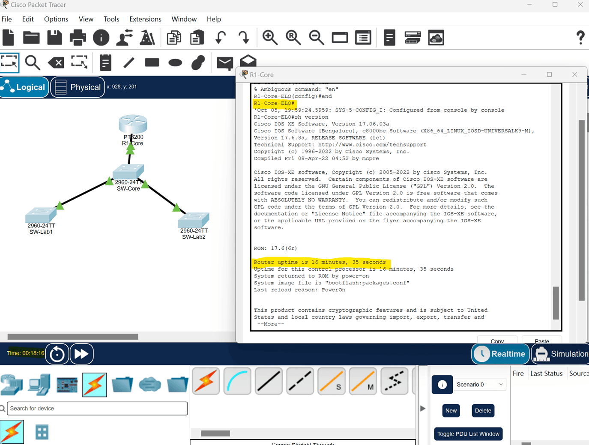

# ✨ Ejemplo de Entrega (Modelo para el Alumno)

[🏠 Inicio](README.md) | [📋 Instrucciones Generales](instrucciones.md) | [🏢 Problema: "TechCorp"](problema.md) | [✨ Ejemplo de Entrega](ejemplo-entrega.md) | [📊 Criterios de Evaluación](criterios-evaluacion.md) | [✅ Lista de Cotejo](lista-cotejo.md)

---
# Ejemplo de entrega de la primera sesion (recuerda que son varias sesiones de trabajo)

### 📋 Sigue un plan de Configuración de Red en orden por objetivos:
- [x] Crear el diagrama y cablear acorde a la topologia.
- [ ] Crear la tabla de direccionamiento.
- [ ] Asignar nombre a los dispositivos con tus iniciales al final ej. (`R1-Core-ELO`).
- [ ] Realizar las tareas de configuracion básica de sw y router (contraseñas), y mensaje del dia.
- [ ] Crear las VLANs.
- [ ] Asignar los puertos a las VLANS.
- [ ] Verificar la configuracion de la VLANs.
- [ ] Habilitar los enlaces troncales.
- [ ] Verificar la configuracion de los enlaces troncales.
- [ ] Guardar la configuración
- [ ] Configurar la subinterfaces en el router.
- [ ] Asignar direccionamiento IP y encapsulamiento Dot1Q
- [x] Verificar conectividad con Ping



*(Agrega las imagenes puedes guiarte con esta estructura para armar su README)*
**recomiendo crear una imagen en una carpeta** `imgs` y colocar ahi las imagenes
```bash

```
## 📋Crea Tabla de direccionamiento

#### Tabla A: Dispositivos Intermedios (Routers y Switches) EJEMPLO

| Dispositivo / Interfaz | VLAN | Segmento de Red Base | Dirección IP a Calcular / Configurar | Máscara de Subred | Gateway por Defecto |
| :--- | :---: | :--- | :--- | :--- | :--- |
| **R1-Core-ELO** (`G0/0/0.10`) | 10 | `192.168.10.0/24` | **Última IP utilizable del segmento** | `255.255.255.0` | *No aplica* |
| **R1-Core-ELO** (`G0/0/0.20`) | 20 | `192.168.20.0/24` | **Última IP utilizable del segmento** | `255.255.255.0` | *No aplica* |


#### Tabla B: Dispositivos Finales (PCs de Usuario y Gestión) EJEMPLO


| Dispositivo Final | Puerto del Switch | VLAN | Dirección IP (Formato CIDR) | Gateway por Defecto |
| :--- | :--- | :---: | :--- | :--- |
| **PC-Administrativos-1** | `SW-Lab2-ELO -> Fa0/1` | 10 | `192.168.10.15/24` | Última IP utilizable del segmento |
| **PC-Alumnos-2** | `SW-Lab1-ELO -> Fa0/2` | 10 | `192.168.10.42/24` | Última IP utilizable del segmento |


## 📥 Archivo de Packet Tracer
- [Descargar mi topología Etapa 1 (.pkt)](etapa1_red.pkt)

#Escribe los comandos que estas ejecuntando para la configuración en tu archivo `readme.md` de la siguiente manera para que se muestren como acontinuación
````markdown
```bash
R1-Core-ELO(config)#interface GigabitEthernet0/0/0.10
```
````


## 📸 Evidencias CLI
```bash
SW-Piso1# show vlan brief
10   Administracion                   active    Fa0/1, Fa0/2
20   Ventas                           active    Fa0/3, Fa0/4
```

A continuación se presenta la configuración de la interfaz en R1-Core:

```cisco
interface GigabitEthernet0/0/0.10
 encapsulation dot1Q 10
 ip address 192.168.10.254 255.255.255.0
```
